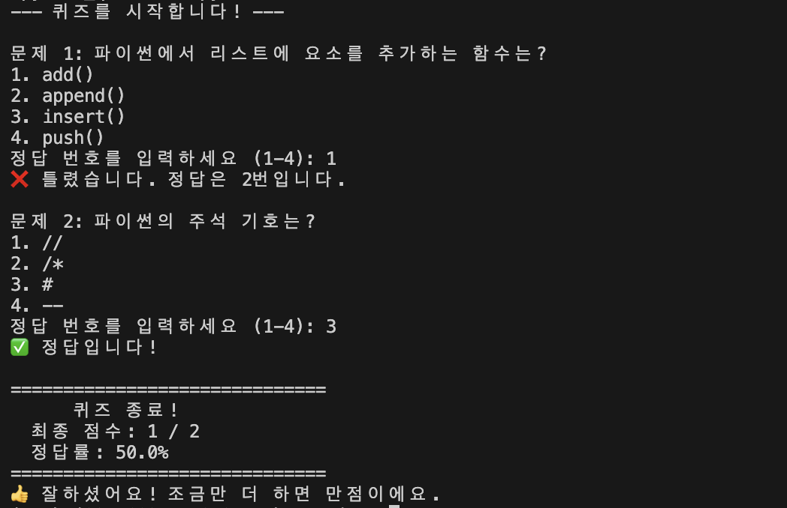
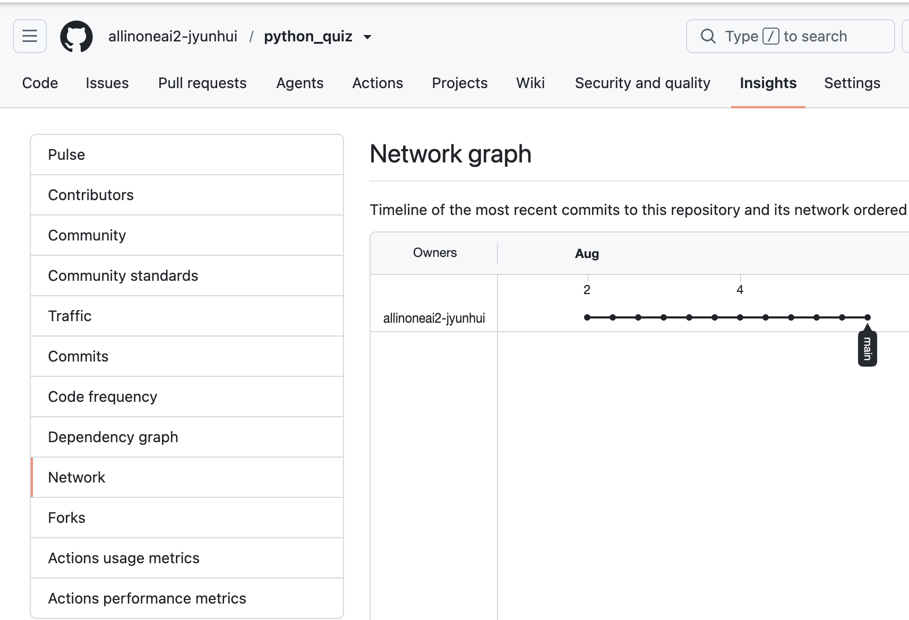
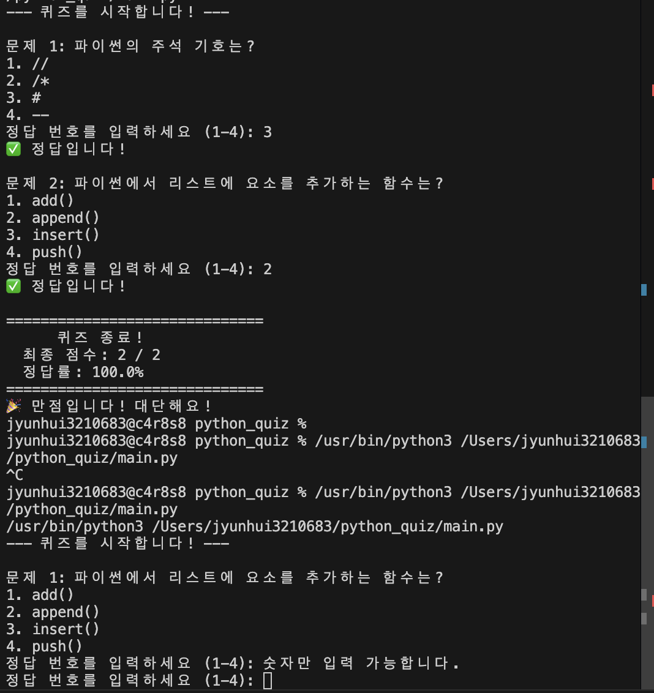

# 파이썬 퀴즈 게임 🎮

파이썬으로 만든 간단한 주제별 퀴즈 프로그램입니다.

## 🚀 주요 기능
- **다양한 주제**: 대한민국, 미국, 중국 관련 문제 제공
- **데이터 저장**: JSON 형식을 사용하여 퀴즈 데이터 관리
- **안정성**: 잘못된 입력에 대한 예외 처리 완료

## 🛠 사용 기술
- Python 3.x
- JSON (데이터 저장)
- Git / GitHub (버전 관리)

## 🐍 파이썬 퀴즈 게임 프로젝트

파이썬 기초를 다지기 위한 10단계 빌드업 프로젝트입니다.

## 📅 프로젝트 로드맵

| 단계 | 작업 내용 | 상태 |
|:---:|:---|:---:|
| 01 | 저장소 설정 및 로드맵 작성 |
| 02 | Quiz 클래스 정의 (데이터 구조화) |
| 03 | 퀴즈 데이터 구성 (JSON 파일 생성)  |
| 04 | 퀴즈 불러오기 및 출력 로직 구현 |
| 05 | 사용자 입력 처리 및 정답 판별 기능 |
| 06 | 점수 계산 및 결과 화면 구현 |
| 07 | 카테고리 선택 기능 추가 (주제별 퀴즈) |
| 08 | 예외 처리 (잘못된 입력 대응) |
| 09 | 코드 리팩토링 및 주석 추가 |
| 10 | 최종 프로젝트 완성 및 사용법 업데이트 |

01. 저장소 설정 및 로드맵 작성
02. Quiz 클래스 정의
03. 퀴즈 데이터 구성
04. 퀴즈 불러오기 및 출력 로직 구현
05. 사용자 입력 처리 및 정답 판별 
### 05단계 실행 결과 스크린샷

06. 점수 계산 및 결과 화면 
### 기존에는 한 문제씩 풀고 정답 여부만 알려줬다면, 이제는 모든 문제를 마친 뒤 총 몇 문제 중 몇 문제를 맞혔는지 

주요 변경 사항
score = 0: 맞힌 문제 수를 세기 위해 변수를 만들었습니다.
score += 1: 사용자가 정답을 맞혔을 때만 점수를 1점씩 올립니다.
최종 결과창: print("="*30) 등을 활용해 결과가 눈에 잘 띄도록 꾸몄습니다.
정답률 계산: (맞힌 개수 / 전체 개수) * 100 공식을 사용해 백분율을 보여줍니다.

07. 문제 섞기
-브랜치 생성 및 병합 : feature-shuffle브랜치를 생성하고 main과 병합.
-결과는 왜 선이 하나만 나올까? : main브랜치에서 feature-shuffle브랜치를 만든 이후에 main브랜치에 아무런 커밋을 하지 않았기 떄문. 이를 Fast-forward라고 함.
### 07단계: 문제 랜덤 섞기
- 실행할 때마다 문제의 순서가 무작위로 변경됩니다.

**실행 예시 1 (브랜치 확인)**
 
코드가 잘 작동하는 것을 확인한 후, 최신 코드를 main브랜치로 합침
병합(merge)을 하면 새 브랜치에서 실험하고 실험 성공시에만 안전하게 main에 저장됨. 협업 시 각자 브랜치에서 작업 후 main으로 병합하면 서로의 코드를 건드리지 않고 안전하게 합칠 수 있음.

**실행 예시 2 (순서 변경 확인):**

08. 예외 처리
### 08단계: 예외 처리 및 안정성 강화
- 잘못된 입력(문자, 범위 밖 숫자) 시 재입력 유도
- JSON 데이터 로드 시 키(Key) 에러 방지 로직 추가

09. 코드 리팩토링 및 주석 추가
10. 최종 프로젝트 완성 및 사용법 업데이트

## 🛠️ 기술 스택
- Language: Python 3.x
- Data Format: JSON
- Version Control: Git / GitHub
