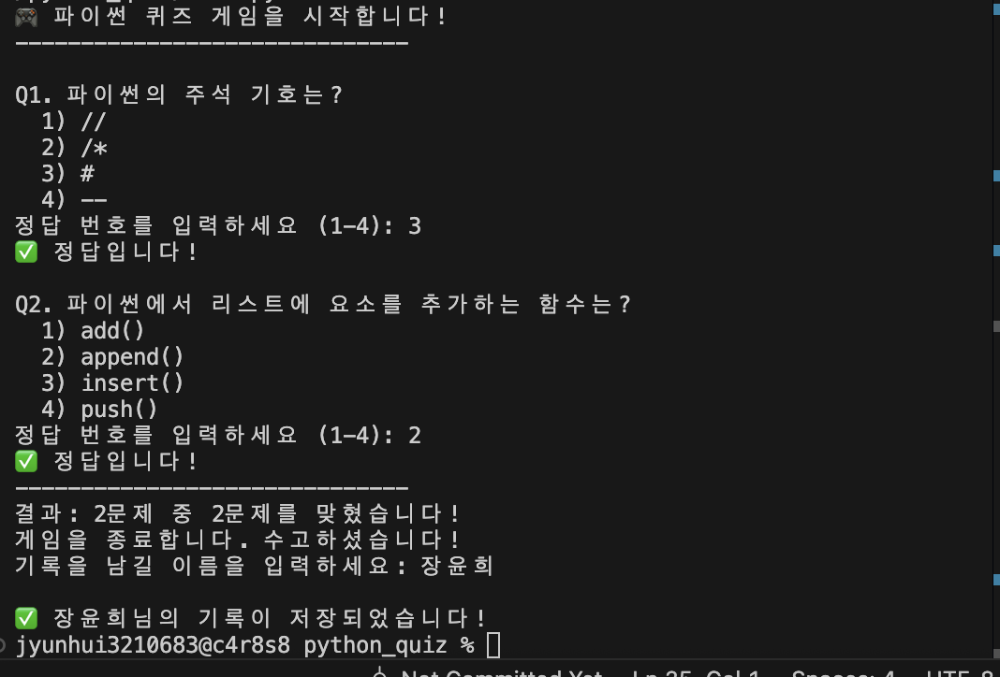
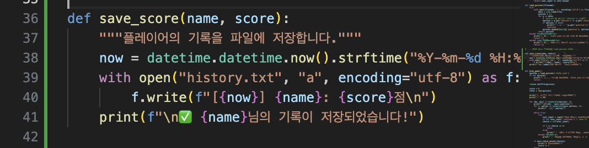
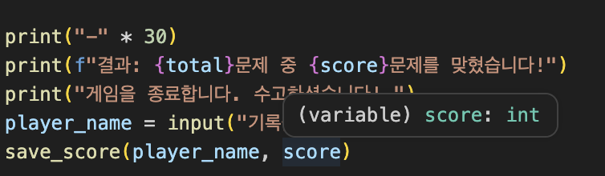
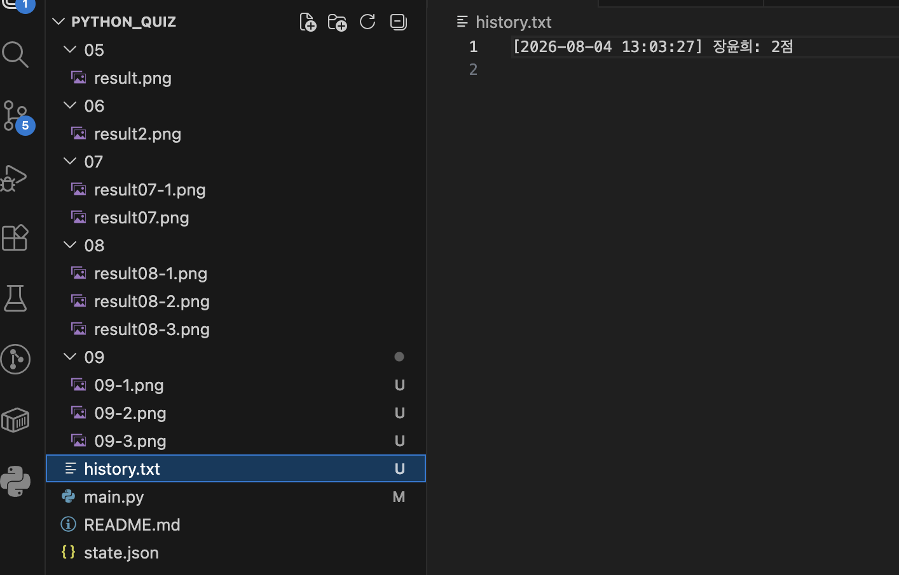

# 파이썬 퀴즈 게임 🎮

파이썬으로 만든 간단한 주제별 퀴즈 프로그램입니다.
## 프로젝트 개요

## 퀴즈 주제 선정 

## 실행 방법

## 기능 목록

## 파일 구조

## 데이터 설명

## 주요 기능
- **다양한 주제**: 기본-대한민국, 미국, 중국 관련 문제, 단계 이후-파이썬 명령어와 주석에 대한 간단 문제
- **데이터 저장**: JSON 형식을 사용하여 퀴즈 데이터 관리
- **안정성**: 잘못된 입력에 대한 예외 처리 완료

## 사용 기술
- Python 3.x
- JSON (데이터 저장)
- Git / GitHub (버전 관리)

## 파이썬 퀴즈 게임 프로젝트
파이썬 기초를 다지기 위한 10단계 빌드업 프로젝트

## 프로젝트 로드맵
| 단계 | 작업 내용 |
|:---:|:---:|
| 01 | 저장소 설정 및 로드맵 작성 |
| 02 | Quiz 클래스 정의 (데이터 구조화) |
| 03 | 퀴즈 데이터 구성 (JSON 파일 생성)  |
| 04 | 퀴즈 불러오기 및 출력 로직 구현 |
| 05 | 사용자 입력 처리 및 정답 판별 기능 |
| 06 | 점수 계산 및 결과 화면 구현 |
| 07 | 카테고리 선택 기능 추가 (주제별 퀴즈) |
| 08 | 예외 처리 (잘못된 입력 대응) |
| 09 | 코드 리팩토링 및 주석 추가 |
| 10 | 최종 프로젝트 완성 및 사용법 업데이트 |

## 01. 저장소 설정 및 로드맵 작성
-Step 01. 환경 설정 및 Git 연동: GitHub 저장소를 생성하고, Personal Access Token(PAT)을 활용해 로컬 환경과 원격 저장소를 연결했습니다.

## 02. Quiz 클래스 정의
-Step 02. Quiz 클래스 설계: 객체 지향 프로그래밍(OOP)을 적용하여 퀴즈의 문제, 선택지, 정답 번호를 관리하는 Quiz 클래스를 정의했습니다.

## 03. 퀴즈 데이터 구성
-Step 03. 데이터 외부화 (JSON): 퀴즈 데이터를 코드 내에 두지 않고 state.json 파일로 분리했습니다. UTF-8 인코딩 처리를 통해 한글 깨짐 문제를 해결했습니다.

## 04. 퀴즈 불러오기 및 출력 로직 구현
-Step 04. 퀴즈 진행 엔진: JSON 데이터를 불러와 사용자에게 문제를 출제하고, 입력을 받아 정답 여부를 판별하는 핵심 로직을 구현했습니다.

## 05. 사용자 입력 처리 및 정답 판별 
-Step 04. 퀴즈 진행 엔진: JSON 데이터를 불러와 사용자에게 문제를 출제하고, 입력을 받아 정답 여부를 판별하는 핵심 로직을 구현했습니다.
### 05단계 실행 결과 스크린샷

## 06. 점수 계산 및 결과 화면 
-Step 06. 결과 분석 및 피드백: 총점 계산, 정답률(%) 표시 및 점수에 따른 맞춤형 피드백 메시지 기능을 추가하여 사용자 경험(UX)을 개선했습니다.
### 기존에는 한 문제씩 풀고 정답 여부만 알려줬다면, 이제는 모든 문제를 마친 뒤 총 몇 문제 중 몇 문제를 맞혔는지 

주요 변경 사항
score = 0: 맞힌 문제 수를 세기 위해 변수를 만들었습니다.
score += 1: 사용자가 정답을 맞혔을 때만 점수를 1점씩 올립니다.
최종 결과창: print("="*30) 등을 활용해 결과가 눈에 잘 띄도록 꾸몄습니다.
정답률 계산: (맞힌 개수 / 전체 개수) * 100 공식을 사용해 백분율을 보여줍니다.

## 07. 문제 섞기
-Step 07. 문제 섞기 및 브랜치 전략: random.shuffle을 이용해 매번 다른 순서로 문제가 출제되도록 했습니다. 이 과정에서 git branch를 생성하고 merge하는 실무 협업 프로세스를 실습했습니다.
-브랜치 생성 및 병합 : feature-shuffle브랜치를 생성하고 main과 병합.
-결과는 왜 선이 하나만 나올까? : main브랜치에서 feature-shuffle브랜치를 만든 이후에 main브랜치에 아무런 커밋을 하지 않았기 떄문. 이를 Fast-forward라고 함.
### 07단계: 문제 랜덤 섞기
- 실행할 때마다 문제의 순서가 무작위로 변경됩니다.

**실행 예시 1 (브랜치 확인)**
 
코드가 잘 작동하는 것을 확인한 후, 최신 코드를 main브랜치로 합침
병합(merge)을 하면 새 브랜치에서 실험하고 실험 성공시에만 안전하게 main에 저장됨. 협업 시 각자 브랜치에서 작업 후 main으로 병합하면 서로의 코드를 건드리지 않고 안전하게 합칠 수 있음.

**실행 예시 2 (순서 변경 확인):**

## 08. 예외 처리
-Step 08. 코드 리팩토링: 전역 변수 사용을 최소화하고 함수 단위로 기능을 쪼개어 코드의 가독성과 재사용성을 높였습니다.
### 08단계: 예외 처리 및 안정성 강화
- 잘못된 입력(문자, 범위 밖 숫자) 시 재입력 유도
- JSON 데이터 로드 시 키(Key) 에러 방지 로직 추가

### 08단계 결과물

## 09. 코드 리팩토링 및 주석 추가
-Step 09. 문서화 및 포트폴리오 완성: 프로젝트 실행 화면을 스크린샷으로 기록하고, README.md를 마크다운으로 작성하여 GitHub 포트폴리오로서의 완성도를 높였습니다.
### 📸 Screenshots
여기에서 게임 실행 화면을 확인할 수 있습니다.
### 1. 게임 시작 및 문제 화면

### 2. 기록 저장을 위해 이름 입력하는 기능 추가

### 3. 결과 확인에 기록 저장 기능 추가(마지막 두 줄)

### 4. 기록 저장 화면 생성 확인(history)

## 10. 최종 프로젝트 완성 및 사용법 업데이트

## 🛠️ 기술 스택
- Language: Python 3.x
- Data Format: JSON
- Version Control: Git / GitHub
